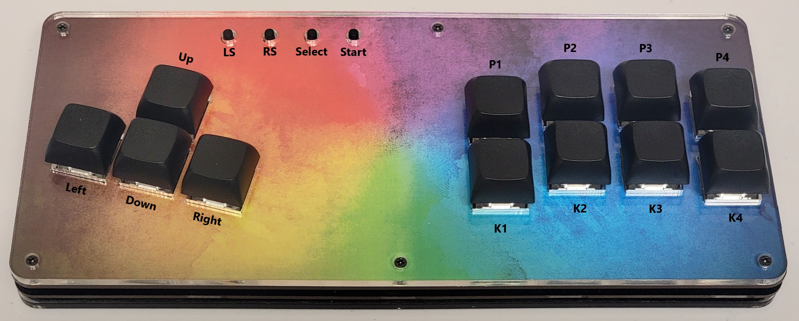

# vsFIGHTER Firmware

Firmware for the [vsFIGHTER](https://github.com/LeafCutterLabs/vsFIGHTER) by [Leaf Cutter Labs](https://github.com/LeafCutterLabs) supporting XInput and Nintendo Switch.

## Installation

> NOTE: Any saved configuration will be cleared when reflashing the controller!

An update package is provided that uses PowerShell and a bundled version of avrdude to handle flashing the microcontroller. If you're familiar with this process or on Linux/Mac, you can just extract the `.hex` file and flash it manually.

**Using the Update Script**:

Follow these steps to update your firmware:

1. Download and extract the latest firmware update package from [Releases](https://github.com/FeralAI/vsFIGHTER-Firmware/releases).
1. Press the reset button twice quickly on the bottom of your vsFIGHTER. You'll need a small screwdriver or toothpick to press it. This will put the microcontroller into bootloader mode for about 10 seconds.
1. Run the `update.bat` file from the extracted firmware update folder. Make sure you do this within a few seconds of resetting the board otherwise it will fail.

**Manual Installation**:

You will need `avrdude` for your platform and the COM port of your board when in bootloader mode. Run the following command, replacing `$port` with your COM port (COM10 for example). Have this command ready and run it right after resetting into bootloader mode with the double press:

```sh
avrdude -v -Cavrdude.conf -patmega32u4 -cavr109 -P $port -b57600 -D -Uflash:w:vsFIGHTER-Firmware.hex:i
```

If the firmware filename is different, make sure to update it before running the command...and that's it! If all went well you should see a success message at the end like `avrdude.exe: 15206 bytes of flash verified` and `avrdude.exe done.  Thank you.` If you have issues, try running through the steps again or [opening an issue](https://github.com/FeralAI/vsFIGHTER-Firmware/issues/new).

## Usage

### Layout



The vsFIGHTER uses a standard 8-button fightstick layout with 4 additional tact switches for the auxiliary buttons. Here is a button mapping table for all support input types:

| Generic | XInput | Switch |
| ------- | ------ | ------ |
| P1      | X      | Y      |
| P2      | Y      | X      |
| P3      | RB     | R      |
| P4      | LB     | L      |
| K1      | A      | B      |
| K2      | B      | A      |
| K3      | RT     | ZR     |
| K4      | LT     | ZL     |
| LS      | LS     | LS     |
| RS      | RS     | RS     |
| Select  | Back   | -      |
| Start   | Start  | +      |

Any references to these buttons will use the `Generic` labels in this documentation.

### Home Button

There is no dedicted Home/Logo button on the vsFIGTHTER, but you can activate it via the button combination **`SELECT + START + DOWN`**.

### Input Modes

To change the input mode, **hold one of the following buttons as the controller is plugged in:**

* **`SELECT`** for Nintendo Switch
* **`START`** for XInput

Input mode is saved across power cycles.

### D-Pad Modes

You can switch between the 3 modes for the D-Pad **while the controller is in use by pressing one of the following combinations:**

* **`SELECT + START + UP`** - D-Pad
* **`SELECT + START + LEFT`** - Emulate Left Analog stick
* **`SELECT + START + RIGHT`** - Emulate Right Analog stick

D-Pad mode is saved across power cycles.
